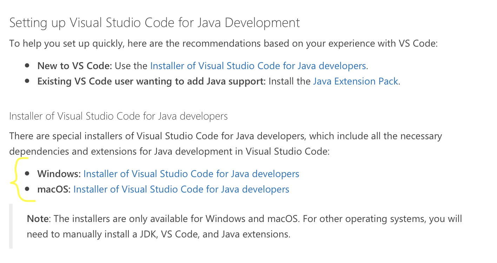
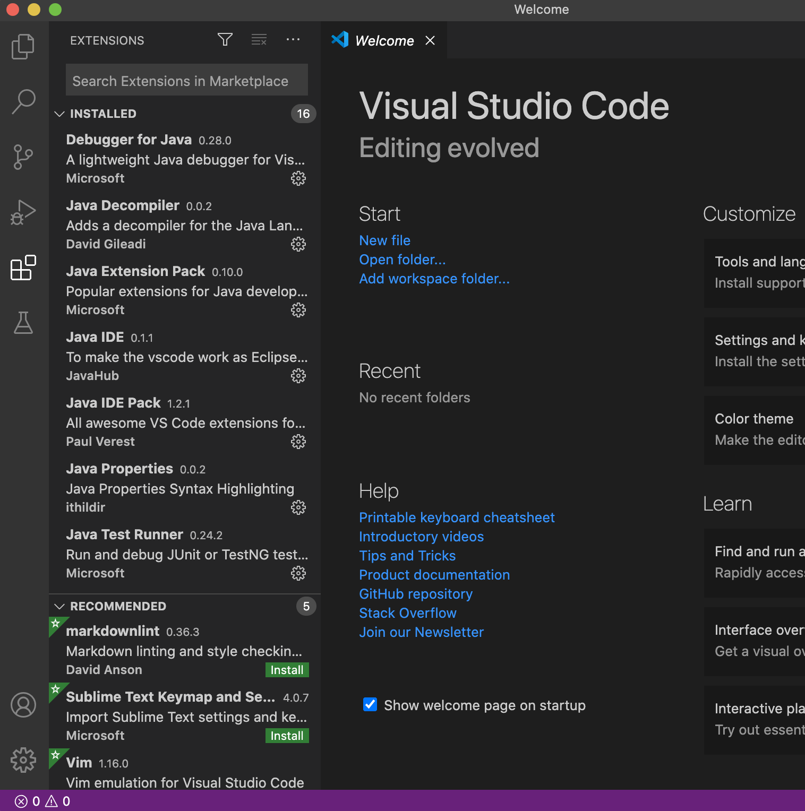
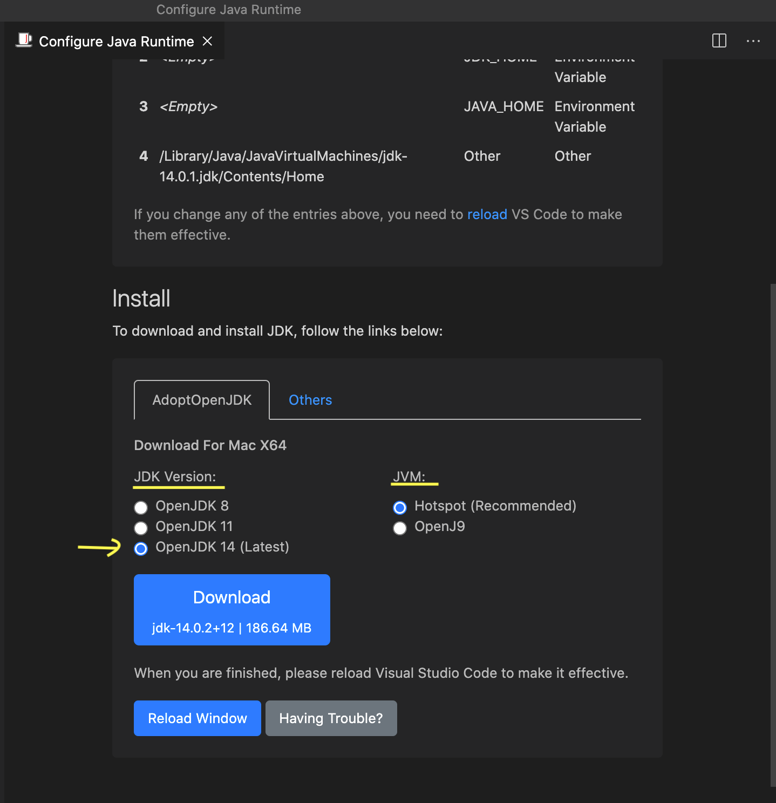

# Introduction à Visual Studio Code

Visual Studio Code est l'outil de développement intégré qui sera utilisé durant la session.

Les fonctionnalités élémentaires de VSCode seront présentées durant l'atelier.

## Installations

- Dépendamment de l'OS utilisé, On va commencer par l'installation de Visual Studio Code : https://code.visualstudio.com/download

- Il faudra par la suite configurer l'environnement de développement Java : https://code.visualstudio.com/docs/java/java-tutorial

- Configurer l'environnement de développement en déclarant la variable d'environnement JAVA_HOME (Ceci sera expliqué durant l'atelier).
- Dans le menu "Extention", installez "Java IDE Pack"

- Dans Command Palette -> Java : Configure Java Runtime, Selectionnez la version JDK 14 et Hotspot comme JVM.

## Exercices 

L'énoncé est disponible sur ce [lien](https://github.com/jacquesberger/exemplesINF2050/blob/master/ateliers/VSCode/enonce.md)

